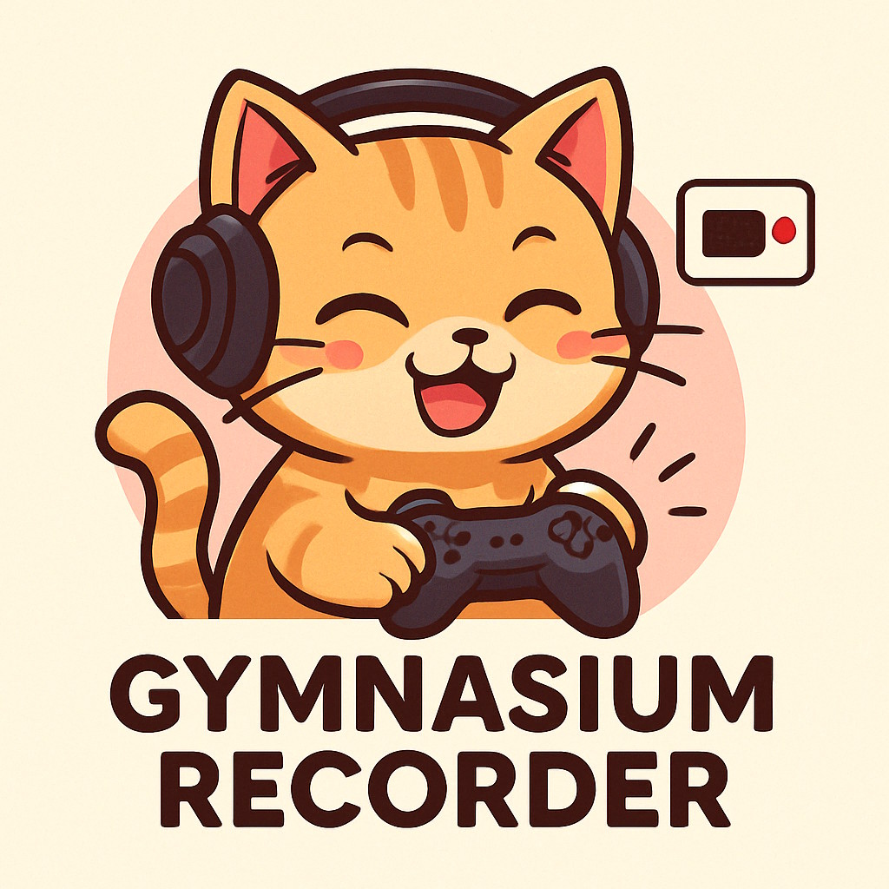

# 🎮 gymnasium-recorder

<p align="center">
  
</p>


🎬 Record [Gymnasium ALE](https://ale.farama.org/environments/) gameplays as Hugging Face datasets with ease

## 📖 Overview

gymnasium-recorder is a tool that wraps [Gymnasium ALE environments](https://ale.farama.org/environments/) (specifically Atari games) to record gameplay sessions as datasets. It captures frames and actions during interactive play, saving them as structured datasets that can be uploaded to Hugging Face Hub.

The resulting dataset includes the columns `episode_id`, `timestamp`, `step`, `action`, and `image`.

Frames are stored as JPEG images using OpenCV for faster write performance.

The tool provides a pygame interface for playing Atari games while recording your actions, making it easy to create training datasets for reinforcement learning models. It also supports replaying recorded sessions to verify environment determinism.

## 🚀 Installation

```bash
# Clone the repository
git clone https://github.com/yourusername/gymnasium-recorder.git
cd gymnasium-recorder

# Create and activate the conda environment
source activate-env.sh

# Create a .env file with your Hugging Face token
cp .env.example .env
# Edit .env with your token
```

## 🛠️ Usage

### Recording a gameplay session

```bash
python main.py record BreakoutNoFrameskip-v4
```

This will open a pygame window where you can play Breakout. The tool reads the
framerate from the environment's metadata so the game runs close to the original
console speed (you can override it with ``--fps``). Use the following controls:
- Space: Action 1
- Right Arrow: Action 2
- Left Arrow: Action 3

For VizDoom environments the keys are mapped automatically so that:
- Arrow keys move forward/backward and turn left/right
- Alt + Left/Right Arrow strafes left/right
- Shift makes the agent run
- Ctrl fires the current weapon
- Spacebar performs the `USE` action (open doors, switches)
- Number keys 1–7 select weapons if available

You can hold multiple direction keys together to combine actions (for example,
Up + Right to move forward while turning). Running, strafing and firing can also
be combined with movement.

When a recording starts, the first game frame is shown with a translucent
overlay asking you to press <kbd>SPACE</kbd>. This lets you focus the window
before gameplay begins.

Press `ESC` at any time to stop playing and automatically upload the frames recorded so far. If you want to exit without uploading you can press `Ctrl+C` instead. The session will be automatically saved as a dataset and uploaded to Hugging Face Hub if you've provided a token.

### Replaying a recorded session

```bash
python main.py playback BreakoutNoFrameskip-v4
```

This will replay a previously recorded session from Hugging Face Hub, allowing you to verify the environment's deterministic behavior.

### Listing available environments

```bash
python main.py list_environments
```

This will print all Atari environments, all stable-retro games with ROM availability
indicated using `(imported)` or `(missing ROM)`, and any VizDoom environments
found (including WADs if present).

## 📄 License

This project is licensed under the [MIT License](LICENSE).